# Daftar Isi
* [Pengenalan Algoritma dan Pemrograman](#pengenalan-algoritma-dan-pemrograman)
* [Instalasi Software](#instalasi-ide)
* [Input dan Output](#input-dan-output)
# Pengenalan Algoritma dan Pemrograman
## Algoritma
```` Markdown
Algoritma adalah sebuah prosedur yang berisi baris-baris langkah untuk
melakukan komputasi atau menyelesaikan suatu masalah. (Kenneth H. Rosen)
````
Dalam hal ini, maka sebuah algoritma harus memenuhi persyaratan-persyaratan berikut:
* Langkahnya terhingga (_finiteness_)
* Instruksi jelas (_definiteness_)
* Memiliki masukan dan keluaran (_input and output_)
* Efektif (_effectiveness_)
* Bersifat umum dan menghasilkan keluaran yang benar (_generality and correctness_)

Mari kita analisis contoh algoritma sederhana berikut ini: [[https://twitter.com/tokopedia/status/1286596493726511105]].

## Pemrograman
`````
Pemrograman adalah pemberian instruksi kepada komputer untuk melakukan suatu tugas tertentu.
`````
Instruksi-instruksi tersebut dituliskan dalam bentuk barisan kode dengan menggunakan bahasa pemrograman. Bahasa pemrograman memungkinkan manusia untuk menuliskan suatu perintah yang dapat dipahami oleh komputer. Menurut _Online Historical Encyclopaedia of Programming Languages_, ada 8945 bahasa pemrograman yang pernah dibuat oleh manusia. Beberapa di antaranya sangat populer, seperti Python, Javascript, PHP, dan tentunya bahasa yang akan kita gunakan nanti, yaitu bahasa C.

Mengapa menggunakan bahasa C? Bahasa C merupakan bahasa yang paling mendekati dengan bahasa mesin (__machine language__). Setiap instruksi di C berupa __case sensitive__. Bahasa C dapat menghasilkan kode yang efisien dalam hal kinerja dan penggunaan memori karena termasuk bahasa tingkat rendah yang memungkinkan pengguna untuk mengendalikan secara langsung sumber daya perangkat keras komputer. Bahasa C memiliki kompiler yang sangat efisien dalam mengoptimalkan sebuah kode secara lebih baik, menghasilkan program yang berjalan lebih cepat dan membutuhkan lebih sedikit sumber daya dibandingkan dengan bahasa tingkat lebih tinggi. Meskipun C memiliki tingkat kompleksitas yang lebih tinggi dan memerlukan pemahaman yang lebih dalam, kecepatan dan efisiensi yang tinggi membuatnya menjadi pilihan utama untuk pengembangan sistem operasi, perangkat keras, dan aplikasi yang memerlukan kinerja maksimum.

# Instalasi Software

Ketika ingin belajar pemrograman, sudah pasti kita akan membutuhkan software untuk mendukung hal tersebut. Software-software yang diperlukan di praktikum matkul ini hanyalah 2, yaitu sebuah **code editor** dan **compiler**

1. `Code Editor`: code editor merupakan aplikasi yang digunakan untuk menulis code dari software yang ingin dikembangkan. Dalam praktikum ini, kita akan menggunakan Visual Studio Code. Selain itu, sebenarnya ada banyak code editor lainnya, seperti

      - Sublime Text
      - Vim
      - Emacs
      - Notepad++, dll

2. `Compiler`: compiler merupakan software yang digunakan untuk menerjemahkan source code dari suatu bahasa pemrograman menjadi bahasa mesin (*machine code*) atau bahkan ke bahasa pemrograman lainnya. Dalam praktikum ini, kita akan menggunakan compiler bahasa C yang disediakan oleh GNU Compiler Colection.

   Namun, ada compiler C lain yang juga sering digunakan, yaitu Clang yang dikembangkan oleh Apple.


<!-- * [MinGW](https://telkomuniversity.dl.sourceforge.net/project/mingw-w64/Toolchains%20targetting%20Win32/Personal%20Builds/mingw-builds/installer/mingw-w64-install.exe) -->

## Instalasi Visual Studio Code
### Windows
1. Install Visual Studio Code sesuai dengan OS yang dipakai pada link berikut [Visual Studio Code](https://code.visualstudio.com/) 

   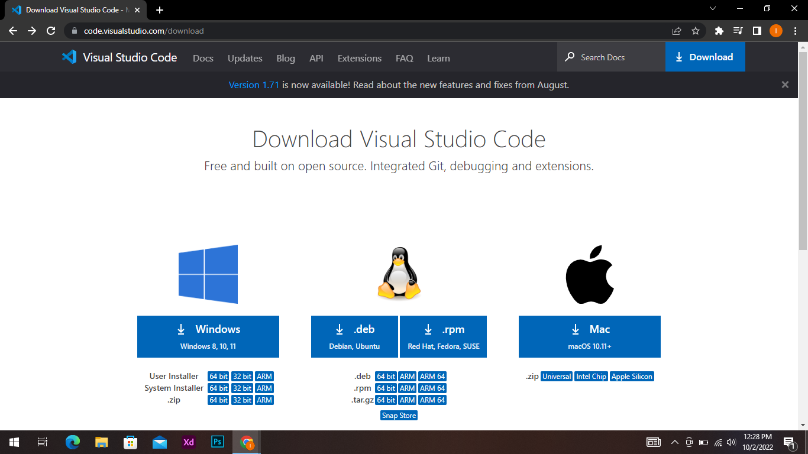
2. Setelah instalasi selesai, buka file yang telah diinstal dan klik "I accept the agreement". Lalu, klik next.

   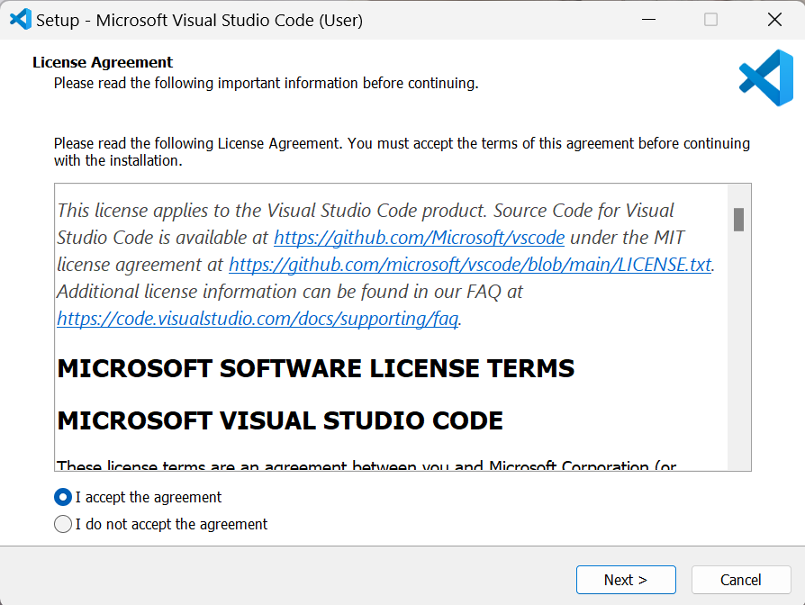
3. Biarkan semua tercentang secara *default*. Klik next.

   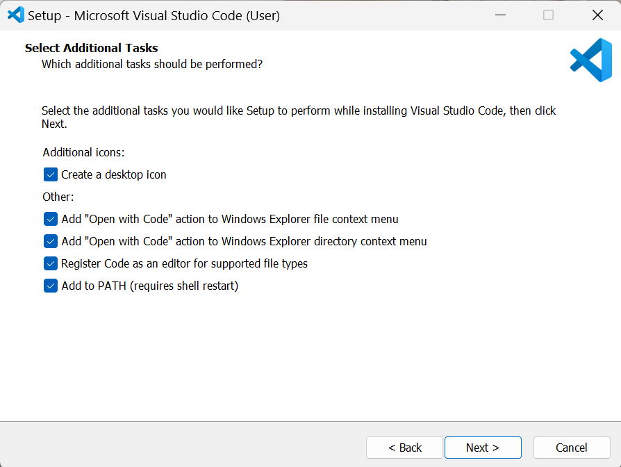
4. Tunggu proses instalasi hingga selesai.

   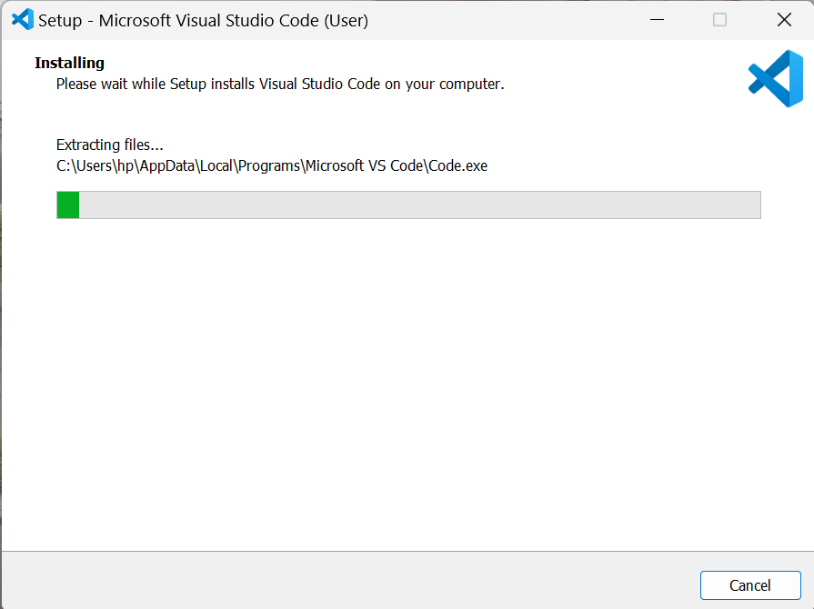
5. Instalasi selesai dan Visual Studio Code siap digunakan!

   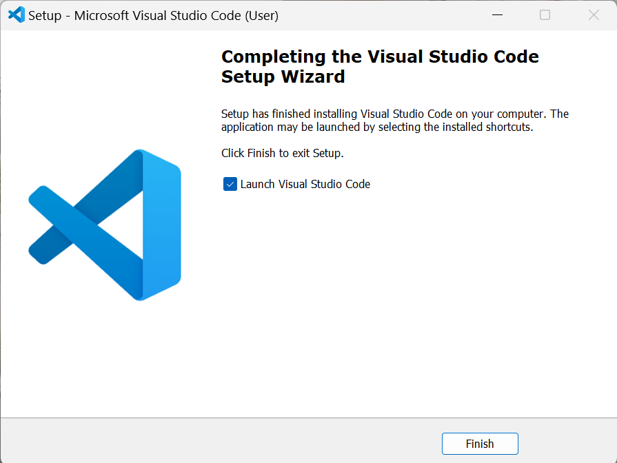

### Linux (*Debian-based*)

Pertama-tama, download debian package dari VSCode dari web **https://code.visualstudio.com/Download**. 

Pilihlah sesuai arsitektur CPU. Laptop/komputer modern biasanya menggunakan `x64`, kecuali laptop/komputer keluaran Apple yang menggunakan `arm64`.

Jika sudah didownload, maka file deb akan ada di `~/Downloads`. Pindahkan file ke `/tmp`:

```bash
mv ~/Downloads/code*.deb /tmp
```

Ubah permission menjadi executable oleh user:

```bash
chmod u+x /tmp/code*.deb
```

Install menggunakan package manager

```bash
sudo apt install /tmp/code*.deb
```

Untuk distro Linux selain yang berbasis Debian, silakan disesuaikan dengan menggunakan `dnf`, `pacman`, atau package manager lainnya. 


## Instalasi Compiler C (GCC / GNU Compiler Collection)

GCC (GNU Compiler Collection) merupakan koleksi compiler dari GNU Project yang mendukung berbagai bahasa pemrograman, salah satunya adalah C. GCC juga berisi compiler untuk Ada, Fortran, dan bahasa-bahasa lainnya.

### Windows
#### Instalasi MinGW (Minimalist GNU for Windows)

Secara default, compiler C tidak ada di Windows. Namun, bisa diinstall melalui MinGW.

1. Download MinGW pada link berikut [MinGW Download](https://sourceforge.net/projects/mingw/) 
2. Setelah MinGW berhasil didownload, lakukan instalasi MinGW sesuai dengan gambar di bawah ini.
    - klik `install`

      
 
   - klik `continue`

      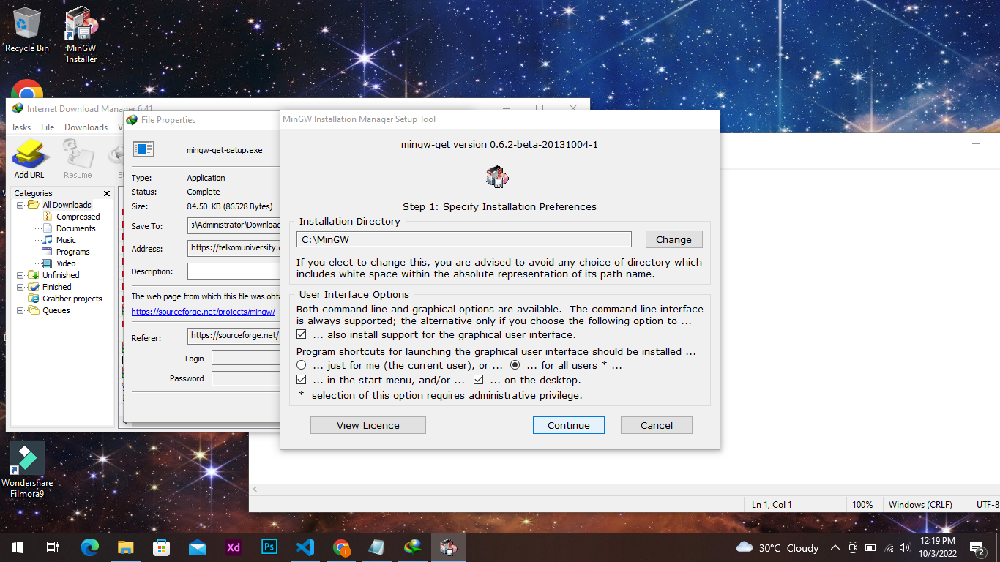

   - tunggu proses instalasi selesai

      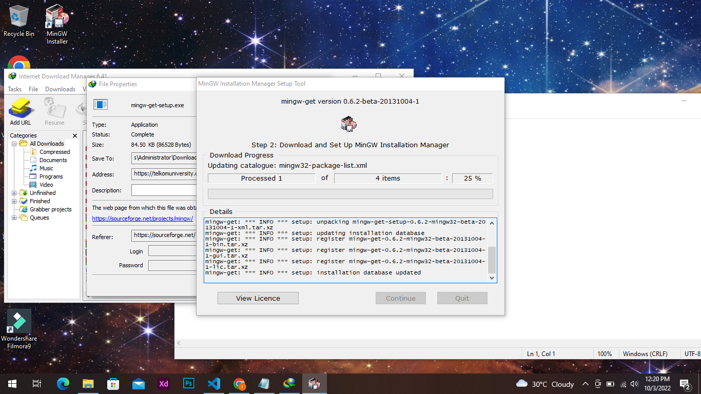

   - klik `Continue`

      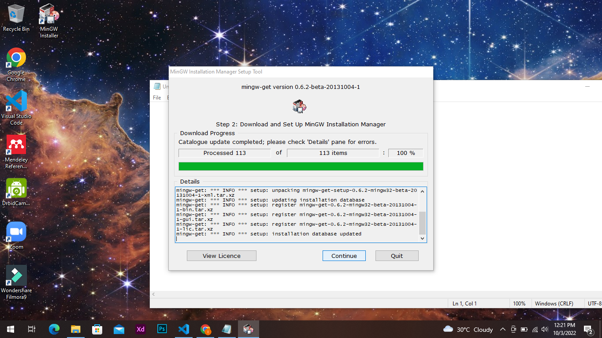

   - klik `Mark for installation` pada semua package

      

   - klik `Apply Changes`

      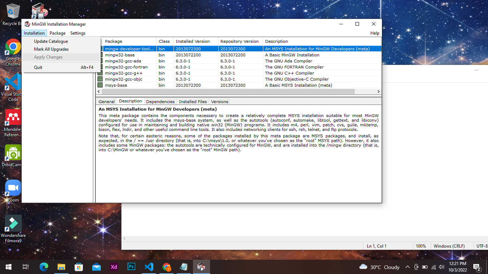

3. Setelah instalasi selesai, akses folder instalasi MinGW dan cari folder dengan nama `bin`

4. Kemudian copy letak folder bin seperti gambar berikut (sesuaikan dengan alamat folder kalian menginstall MinGW)

   

5. Buka windows dan cari `Edit the system environment variables`

   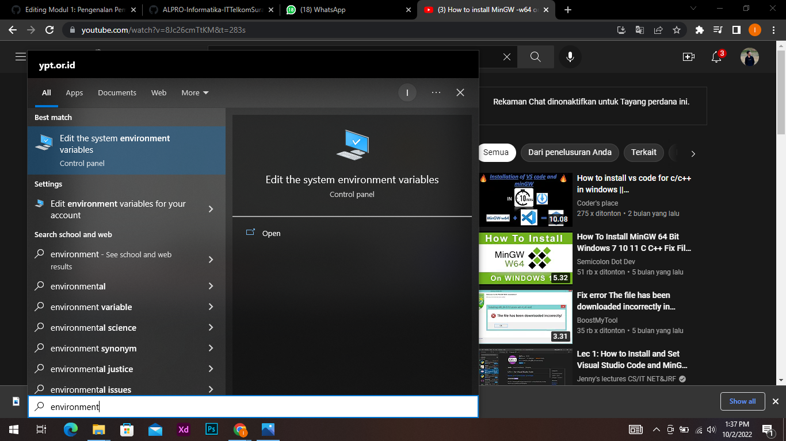

6. Klik pada tab `Edit the system environment variables`

   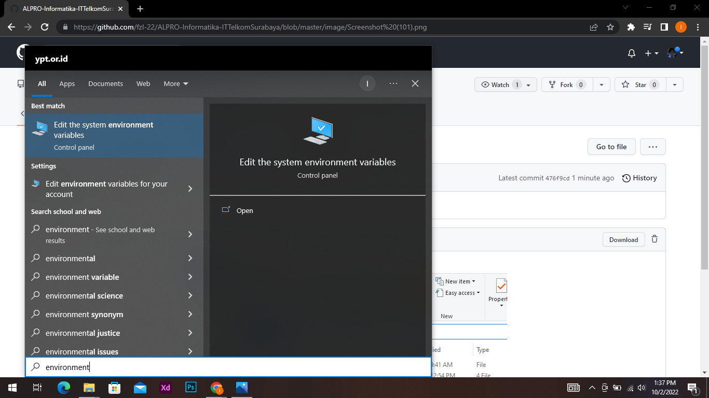

7. Klik `Environment Variables`. Kemudian pada bagan `system variabel` pilih tab `path` dan klik `edit`

   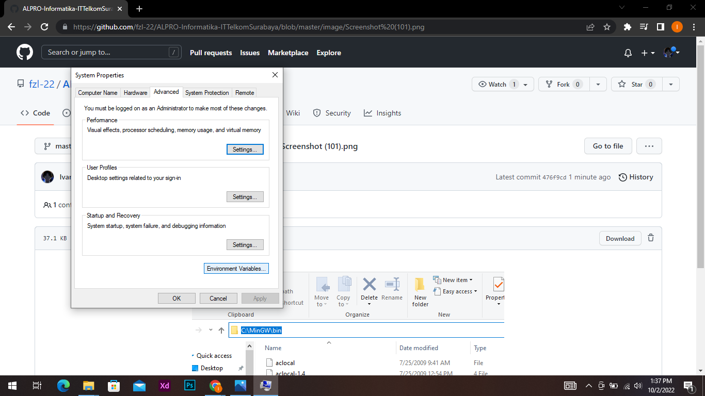

8. Setelah tab edit environment variabel terbuka, klik tab `edit`

   

9. Kemudian pastekan alamat folder bin MinGW yang telah dicopy sebelumnya

   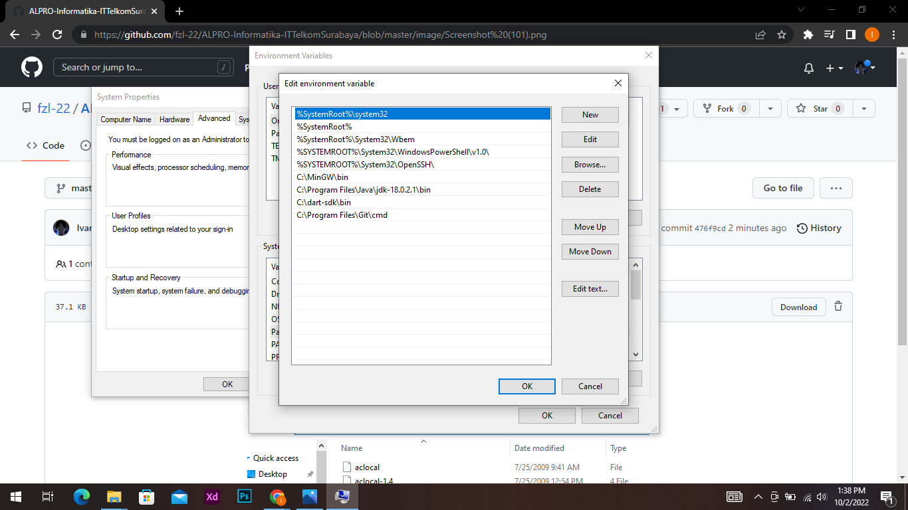

10. Reboot laptop. Buka Powershell, kemudian ketikkan `gcc --version`. Instalasi dikatakan sukses apabila terminal menampilkan versi GCC.

### Linux (*Debian-based*)

Menginstall GCC di Linux berbasis Debian sangat mudah, cukup dengan menjalankan perintah:

```bash
sudo apt update && sudo apt install build-essential
```

Namun, kadang-kadang distro lain menggunakan nama package yang berbeda. Sebagai contoh, package `build-essential` ekuivalen dengan package `base-devel` di Arch Linux.

## Konfigurasi VSCode

1.  Tambahan untuk bahasa C/C++ pada VSCode dilakukan pemasangan ekstension seperti pada gambar berikut dengan klik install

      

2.  Pasang ekstensi Code Runner

      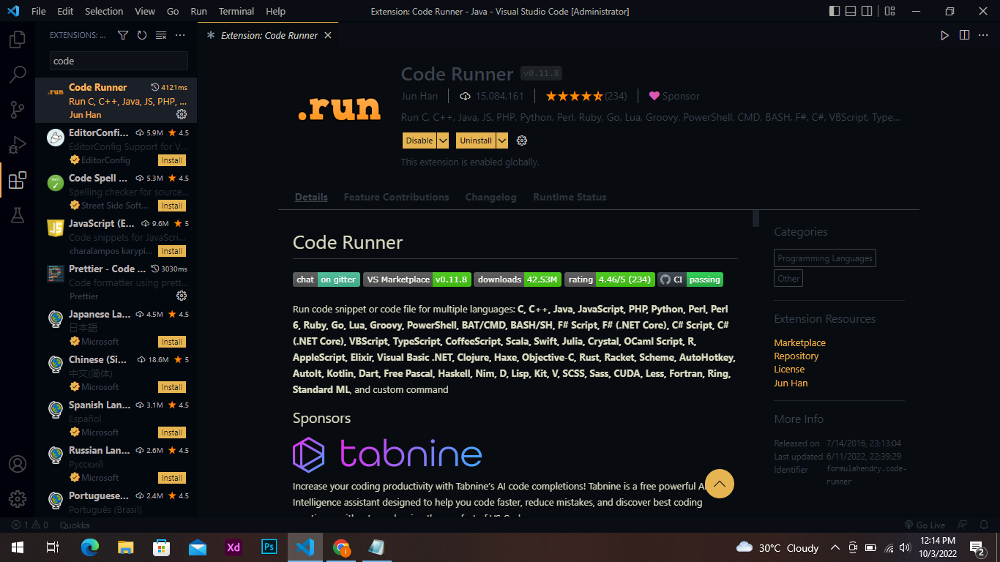 

3.  Yang Terakhir ubah konfigurasi untuk running programnya ke terminal dengan cara klik **file > preferences > settings > Extension > Run code configuration > check list bagian yang bertulisan Run in Terminal**

# Input dan Output
Dalam pemograman, kita dapat memasukkan(_input_) data ke dalam program dan dapat mengeluarkan (_output_) data. Operasi _input_ dan _output_ dilakukan dengan menggunakan fungsi-fungsi yang ada pada library `<stdio.h>`. Sebelum itu, mari kita mengenal struktur utama program C.
``````C
#include <stdio.h>              // header file
                                
int main()                      // fungsi utama (main)
{                               // pembuka fungsi
   printf("Hello World\n");     // statement
   return 0;                    // statement
}                               // penutup fungsi
``````
| Struktur | Keterangan |
|:----:|:----|
|Header File|File dengan ekstensi `.h` dan memiliki preprocessor directive (`#include`). Dalam kasus ini, `#include <stdio.h>` berarti program menyertakan _header file_' `<stdio.h>` yang memungkinkan program untuk melakukan operasi input dan output standar.|
|Fungsi Utama|Fungsi `main()` adalah fungsi utama, yaitu fungsi yang akan dieksekusi terlebih dahulu oleh compiler.|
|Pembuka dan Penutup Fungsi|Simbol `{` dan `}` secara berturut-turut merupakan awal dan akhir sebuah fungsi. Di antara kedua simbol tersebut, terdapat tubuh fungsi (_function body_) yang berisikan statement dari fungsi tersebut.|
|Statement|Sebaris program yang berisi perintah tertentu dan diakhiri oleh simbol semicolon (`;`). Dalam kasus ini, `printf("Hello World\n");` memerintahkan komputer untuk mencetak string bertuliskan "Hello World" dan baris baru (\n). Sedangkan, `return 0` pada menandakan bahwa fungsi main tidak mengembalikan value apapun.|
 
## Output Dasar
### Fungsi `printf()`
Fungsi `printf()` merupakan fungsi untu menampilkan output ke layar komputer. Fungsi ini terdapat pada library `stdio.h`, untuk itu kita diharuskan untuk menulis `#include <stdio.h>` dibagian atas program agar fungsi ini dapat digunakan.

``````` C
#include <stdio.h>

int main()
{
   printf("ini adalah sebuah string");
   return 0;
}
```````
Output
```````
ini adalah sebuah string
```````

Namun, contoh diatas tidak bisa menambahkan baris baru
``````` C
#include <stdio.h>

int main()
{
   printf("ini adalah sebuah string");
   printf("aku adalah baris baru");
   return 0;
}
```````
Output
```````
ini adalah sebuah stringaku adalah baris baru
```````
Untuk membuat baris baru, harus menambahkan `\n` setelah baris pertama. `\n` dapat disebut **escape sequence**
``````` C
#include <stdio.h>

int main()
{
   printf("ini adalah sebuah string\n");
   printf("aku belajar bahasa C");
   return 0;
}
```````
Output
```````
ini adalah sebuah string
aku belajar bahasa C
```````
kita juga bisa menampilkan beberapa baris dengan satu fungsi `printf()`
``````` C
#include <stdio.h>

int main()
{
   printf("ini adalah sebuah string\naku belajar bahasa C\nIni sangat menyenangkan");
   return 0;
}
```````
Output
```````
ini adalah sebuah string
aku belajar bahasa C
Ini sangat menyenangkan
```````
### Format Specifier
default dari fungsi `printf()` selalu berupa string. untuk menampilkan nilai pada suatu tipe data dapat menggunakan **Format Specifier**. Setiap tipe data memiliki **Format Specifier** masing masing.
```````C
printf("%<format specifier>", var);
```````
Sebagai contoh, kita mempunyai variabel int `a = 3`. untuk mencetak variabel tersebut, maka di dalam fungsi `printf()` dapat ditulis seperti ini :
``````` C
#include <stdio.h>

int main()
{
    int a = 3;
    printf("output a = %i",a);
    return 0;
}

```````
output
```````
output a = 3
```````
| format | keterangan |
| ------ | ---------- |
| `%i` & `%d` | digunakan untuk tipe data `int` |
| `%f` | digunakan untuk tipe data `float` |
| `%c` | digunakan untuk tipe data `char` |
| `%s` | digunakan untuk tipe data `string` |
## Input Dasar
### Fungsi `scanf()`
Input merupakan interaksi antara user dengan program, sehingga program dapat menerima data yang diberikan oleh user dan disimpan di suatu variabel. Pada bahasa C, fungsi yang digunakan untuk menerima inputan dari user yakni `scanf()`. Pada fungsi ini, kita menggunakan **Format Specifier**.<br/>
Perhatikan Format dibawah ini : <br/>
```````C
scanf("%<format specifier>", &var);
```````
* fungsi `scanf()` merupakan fungsi untuk mengambil input dari keyboard
* `"format specifier"` yang diberikan tergantung dari jenis tipe data apa yang ingin kita ambil.
* `&` merupakan simbol untuk mengambil alamat memori dari variabel.
* `var` merupakan variabel yang digunakan untuk menyimpan inputan user.

coba perhatikan contoh dibawah ini : <br/>
``````` C
#include <stdio.h>

int main()
{
   int a;
   printf("Masukkan nilai variabel a: ");
   scanf("%d", &a);
   printf("variabel a memiliki nilai = %d", a);
   return 0;
}
```````
Input
```````
3
```````
Output
```````
a memiliki nilai = 3
```````

Namun saat menginputkan teks yang mengadung **spasi**, maka akan terjadi error atau terpecah seperti contoh dibawah ini : 
``````` C
#include <stdio.h>

int main () {
    char name[20], web[30];
    printf("Nama: ");
    scanf("%s", &name);

    printf("web: ");
    scanf("%s", &web);

    printf("Nama yang diinputkan: %s\n", name);
    printf("Web yang diinputkan: %s\n", web);
   
    return 0;
}
```````
Input 
``````` C
nama: git hub  // git hub merupakan imputan
web:           // tidak menerima inputan karena ketika menekan enter untuk input, enter tersebut dianggap input variabel string setelahnya
```````
Output
```````
Nama yang diinputkan: git
Web yang diinputkan: hub
```````
untuk mengatasi masalah tersebut, kita ubah format pada `scanf()` menjadi sebagai berikut : 
``````` 
printf("Nama: ");
scanf("%[^\n]s", &name);
```````
dan setelah menambahkan format sesuai contoh diatas, maka dibawahnya ditambahkan fungsi `fflush(stdin);` karena akan terjadi error apabila terdapat inputan selain contoh diatas.
``````` C
#include <stdio.h>

int main () {
    char name[20], web[30];
    printf("Nama: ");
    scanf("%s", &name);
    fflush(stdin);
    printf("web: ");
    scanf("%s", &web);

    printf("Nama yang diinputkan: %s\n", name);
    printf("Web yang diinputkan: %s\n", web);
   
    return 0;
}
```````
Input 
``````` C
nama: git hub          // git hub merupakan imputan
web: www.github.com    // www.github.com merupakan inputan
```````
Output
```````
Nama yang diinputkan: git hub
Web yang diinputkan: www.github.com
```````

<!-- # Pengenalan HackerRank


Selain IDE, kita juga membutuhkan platform untuk mengasah kemampuan pemrograman kita. [HackerRank](https://www.hackerrank.com/) merupakan satu dari sekian banyak platform tersebut. Kita akan menggunakan HackerRank untuk menunjang kegiatan praktikum Algoritma dan Pemrograman di Informatika. Berikut adalah tutorial mengakses HackerRank:

1. Masuk ke [HackerRank](https://www.hackerrank.com/).
2. Pilih **Sign Up and Code**, kemudian pilih **Log In** jika sudah memiliki akun. Jika belum, pilih **Sign Up** dan isikan data diri yang diminta.
3. Sesudah sampai di **Dashboard**, scroll ke bawah hingga ke **Prepare by Topics**.
4. Pilih bahasa C.

Setelah itu, klik **Solve Challenge** pada soal pertama kita yang berjudul **"Hello World!" in C**! -->